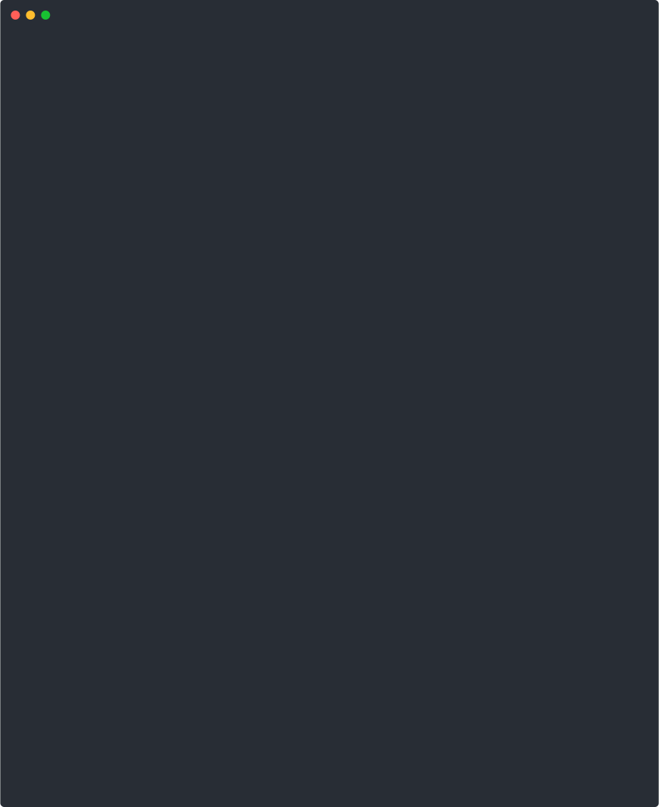

# AgentKernel

**Run any AI agent safely. See everything. Block what's dangerous.**

AgentKernel is an agent security sandbox — a firewall for AI agents. It intercepts all agent actions (file access, network requests, shell commands), enforces security policies, and logs everything for audit. Works with any agent framework (OpenClaw, LangChain, AutoGPT, etc.).

Self-hosted. Open source. Framework-agnostic.

<p align="center">
  
</p>

---

## The Problem

**AI agents are security nightmares.**

- OpenClaw's ClawHavoc malware (Jan 2026): 341 malicious skills stealing credentials, crypto wallets, browser data
- CVE-2026-25253: One-click RCE affecting 50K+ installations
- 76% of CISOs cite agent security as top concern (Gartner 2026)

Agents run with your permissions. They can:
- Read ~/.ssh keys, ~/.aws credentials, browser passwords
- Exfiltrate data to attacker-controlled servers
- Execute arbitrary shell commands
- Mine crypto using your compute

**There is no open-source, self-hostable solution for agent security.**

AgentKernel fixes this.

---

## How It Works

```
┌─────────────────────────────────────────────────────┐
│           YOUR AGENT (Any Framework)                │
│          OpenClaw / LangChain / AutoGPT            │
└──────────────────────┬──────────────────────────────┘
                       │ All operations intercepted
                       ▼
┌─────────────────────────────────────────────────────┐
│              AGENTKERNEL SANDBOX                    │
│                                                     │
│  ┌───────────────────────────────────────────────┐  │
│  │ POLICY ENGINE                                 │  │
│  │ • Block sensitive files (~/.ssh, ~/.aws)      │  │
│  │ • Block internal networks (169.254.169.254)   │  │
│  │ • Block dangerous commands (rm -rf, sudo)     │  │
│  │ • Require approval for secrets                │  │
│  └───────────────────────────────────────────────┘  │
│                                                     │
│  ┌───────────────────────────────────────────────┐  │
│  │ CAPABILITY SYSTEM                             │  │
│  │ • HMAC-signed permission tokens               │  │
│  │ • Time-bounded grants (auto-expire)           │  │
│  │ • Constant-time signature verification        │  │
│  └───────────────────────────────────────────────┘  │
│                                                     │
│  ┌───────────────────────────────────────────────┐  │
│  │ AUDIT LOGGER                                  │  │
│  │ • Every operation logged to PostgreSQL        │  │
│  │ • HIPAA/SOC2 compliant retention              │  │
│  │ • Full request/response capture               │  │
│  └───────────────────────────────────────────────┘  │
│                                                     │
│  ┌───────────────────────────────────────────────┐  │
│  │ PROCESS SANDBOX                               │  │
│  │ • V8 isolates with memory limits              │  │
│  │ • Execution timeouts                          │  │
│  │ • No fs/net/child_process access              │  │
│  └───────────────────────────────────────────────┘  │
└─────────────────────────────────────────────────────┘
                       │
                       ▼
┌─────────────────────────────────────────────────────┐
│               SYSTEM RESOURCES                       │
│          Files / Network / Shell / Secrets          │
└─────────────────────────────────────────────────────┘
```

---

## Features

### Policy Engine
Define what agents can and cannot do:

```yaml
# ~/.agentkernel/policy.yaml
template: balanced

file:
  default: block
  rules:
    - pattern: "**/.ssh/**"
      decision: block
      reason: "SSH credentials"
    - pattern: "~/workspace/**"
      decision: allow
      reason: "Your project folder"

network:
  default: block
  rules:
    - host: "api.telegram.org"
      decision: block
      reason: "Data exfiltration channel"
    - host: "*.github.com"
      decision: allow
      reason: "Code hosting"

shell:
  default: block
  rules:
    - command: "rm -rf*"
      decision: block
      reason: "Destructive operation"
    - command: "git"
      decision: allow
      reason: "Safe dev tool"
```

### Cross-Domain Security

Shell commands that access files are automatically cross-checked against file policies:

```
$ curl -X POST http://localhost:18788/evaluate \
    -d '{"tool":"bash","args":{"command":"cat ~/.ssh/id_rsa"}}'

→ BLOCKED: Shell command "cat" accesses blocked file:
  File path "~/.ssh/id_rsa" matched pattern "~/.ssh/**"
```

Even though `cat` is an allowed command, the file argument `~/.ssh/id_rsa` is blocked. This prevents attackers from using shell commands to bypass file policies — a common blind spot in other security tools.

### User-Friendly CLI

No YAML editing required — manage policies with simple commands:

```bash
agentkernel init                        # Interactive wizard
agentkernel allow "github"              # Allow by name
agentkernel block "telegram"            # Block by name
agentkernel allow --domain api.myapp.com  # Allow a domain
agentkernel allow --file ~/my-project   # Allow a file path
agentkernel policy show                 # Human-readable summary
agentkernel policy test --domain api.telegram.org  # Dry-run test
```

### Capability Tokens
Unforgeable, time-bounded permission grants:

```typescript
import { createCapabilityManager } from '@agentkernel/permissions';

const manager = createCapabilityManager({ secret: process.env.PERMISSION_SECRET });

// Grant limited file access for 1 hour
const token = manager.grant({
  agentId: 'my-agent',
  permissions: [{ category: 'filesystem', actions: ['read'], resource: '/workspace/**' }],
  purpose: 'Read project files',
  durationMs: 3600000,
});

// Check before any operation
const check = manager.check('my-agent', 'filesystem', 'read', '/workspace/src/app.ts');
if (!check.allowed) {
  throw new Error(`Permission denied: ${check.reason}`);
}
```

### Full Audit Trail
Every operation logged to PostgreSQL:

```sql
SELECT * FROM audit_log WHERE agent_id = 'my-agent' ORDER BY created_at DESC;

-- action          | resource_type | resource_id        | outcome
-- file.read       | filesystem    | /workspace/app.ts  | success
-- network.request | network       | api.openai.com     | success
-- file.read       | filesystem    | ~/.ssh/id_rsa      | blocked
-- shell.execute   | shell         | sudo apt install   | blocked
```

### Process Isolation
V8 worker threads with strict resource limits:

```typescript
import { WorkerSandbox } from '@agentkernel/runtime';

const sandbox = new WorkerSandbox({
  maxHeapSizeMB: 64,    // Memory limit
  timeoutMs: 30000,     // 30 second timeout
  maxStackSizeMB: 4,    // Stack limit
});

await sandbox.start();

// Safe globals only - no fs, net, child_process
const result = await sandbox.execute(`
  const data = JSON.parse(context.input);
  return data.items.filter(i => i.active);
`, { input: '{"items":[{"active":true},{"active":false}]}' });

sandbox.terminate();
```

---

## Quick Start

### Installation

```bash
# Install the CLI globally
npm install -g @agentkernel/agent-kernel

# Initialize a security policy (interactive wizard)
agentkernel init

# Start the security proxy (standalone mode — no gateway needed)
agentkernel start
```

### Try It Immediately

Once running, test with curl:

```bash
# Health check
curl http://localhost:18788/health

# Test a blocked operation (should return "blocked")
curl -X POST http://localhost:18788/evaluate \
  -H "Content-Type: application/json" \
  -d '{"tool":"read","args":{"path":"/home/user/.ssh/id_rsa"}}'

# Test an allowed operation (should return "allowed")
curl -X POST http://localhost:18788/evaluate \
  -H "Content-Type: application/json" \
  -d '{"tool":"bash","args":{"command":"git status"}}'

# View live stats
curl http://localhost:18788/stats
```

WebSocket clients can connect to `ws://localhost:18788` and send tool calls in OpenClaw, MCP/JSON-RPC, or Simple `{tool, args}` format.

### From Source

```bash
# Clone
git clone https://github.com/vijaygopalbalasa/AgentKernel.git
cd AgentKernel

# Install dependencies
pnpm install

# Start infrastructure (PostgreSQL, Redis)
docker compose -f docker/docker-compose.test.yml up -d

# Run migrations
pnpm migrate

# Build and test
pnpm build
pnpm test
```

### Environment Variables

```bash
# .env
PERMISSION_SECRET=your-32-char-secret-for-hmac-signing

# Database
DATABASE_HOST=localhost
DATABASE_PORT=5433
DATABASE_NAME=agentkernel_test
DATABASE_USER=agentkernel
DATABASE_PASSWORD=agentkernel_test
```

### Production Hardening

Set `AGENTKERNEL_PRODUCTION_HARDENING=true` (or `NODE_ENV=production`) to fail fast on unsafe defaults. When enabled, AgentKernel enforces:
- `PERMISSION_SECRET` is set (>= 32 chars) and not a placeholder
- `LOG_LEVEL` is not `debug` or `trace`
- `DATABASE_SSL=true` when the database host is not local
- `REDIS_PASSWORD` is set when Redis is not local
- Policy default decision is `block`
- Sandbox permissions are enforced and dangerous defaults are disallowed

---

## Security Standards

- **OWASP Top 10 for Agentic Applications 2026**
- **Shell → file cross-check** (blocks `cat ~/.ssh/id_rsa` even when `cat` is allowed)
- **Capability-based security** (unforgeable tokens)
- **Least privilege** (minimal permissions by default)
- **JIT access** (time-bounded grants)
- **Defense in depth** (multiple security layers)
- **Constant-time verification** (timing attack resistant)

---

## Tech Stack

- **Language:** TypeScript (strict mode)
- **Runtime:** Node.js 20+
- **Package Manager:** pnpm
- **Database:** PostgreSQL
- **Testing:** Vitest (1,200+ tests)
- **Build:** tsup
- **Linting:** Biome

---

## Package Structure

```
agentkernel/
├── packages/
│   ├── kernel/              # Config, logging, database, security utilities
│   ├── runtime/             # Sandbox, audit, policy engine, health
│   ├── framework/
│   │   └── permissions/     # HMAC capability tokens
│   ├── agentkernel-cli/     # CLI binary + security proxy + policy manager
│   ├── cli/                 # Programmatic API for status/audit queries
│   ├── langchain-adapter/   # LangChain tool wrapper with policy enforcement
│   └── shared/              # Types, Result types
└── scripts/                 # Migrations, verification, demos
```

| Package | npm | Description |
|---------|-----|-------------|
| `@agentkernel/agent-kernel` | CLI binary | Security proxy, policy management, audit viewer |
| `@agentkernel/kernel` | Library | Config, logging, PostgreSQL, security utilities |
| `@agentkernel/runtime` | Library | Policy engine, sandbox, audit, lifecycle |
| `@agentkernel/permissions` | Library | HMAC capability tokens |
| `@agentkernel/langchain-adapter` | Library | LangChain tool wrapper |
| `@agentkernel/cli` | Library | Programmatic API for proxy, status, audit |
| `@agentkernel/shared` | Library | Shared types and Result types |

---

## Status

### Completed
- Kernel: Config, logging, PostgreSQL, Redis, Qdrant, security utilities
- Runtime: Sandbox, audit, policy engine, lifecycle, health
- Permissions: HMAC capability tokens with constant-time verify
- AgentKernel CLI: Security proxy, tool interceptor, policy manager, audit logging
- LangChain Adapter: Tool interception with PolicyEngine
- 1,200+ tests across all packages

### AgentKernel CLI
One-command security for any agent:
```bash
npm install -g @agentkernel/agent-kernel
agentkernel init                          # Interactive setup wizard
agentkernel start                         # Start in standalone mode (HTTP + WebSocket)
agentkernel start --gateway ws://gw:18789 # Start in proxy mode (intercept gateway traffic)
agentkernel allow "github"                # Allow GitHub access
agentkernel block "telegram"              # Block data exfiltration
agentkernel policy show                   # View current policy
agentkernel status                        # Live proxy stats (connects to running proxy)
agentkernel audit                         # Query audit logs
```

### LangChain Adapter
Wrap any LangChain tool with policy enforcement:
```typescript
import { wrapToolWithPolicy } from '@agentkernel/langchain-adapter';

const safeTool = wrapToolWithPolicy(myTool, policyEngine, { agentId: 'my-agent' });
```

### In Progress
- Additional framework adapters (AutoGen, CrewAI)

---

## License

MIT

---

**Run any agent safely. See everything. Block what's dangerous.**
